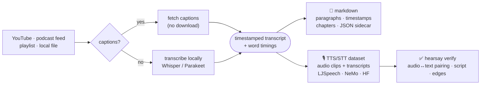

# hearsay

> **crawl4ai for video & audio.** One command turns any YouTube video, channel,
> podcast episode, or local recording into clean, timestamped, LLM-ready **markdown** —
> or a **TTS/STT training dataset** of sliced audio clips paired with verbatim
> transcripts, **verified**: hearsay re-listens to its own output and tells you whether
> the audio matches the text. Captions-first, runs locally, no plumbing.

[](https://pypi.org/project/hearsay/)
[](https://github.com/mudassar531/hearsay/actions/workflows/ci.yml)
[](https://www.python.org/downloads/)
[](LICENSE)

**One input — a link or a file — and two kinds of output.** Read it (RAG, notes,
agents) *or* train on it (text-to-speech, speech recognition):

<table>
  <tr>
    <td width="50%" valign="top" align="center">
      📄 <b>Clean markdown</b> — for RAG, notes &amp; agents<br><br>
      
    </td>
    <td width="50%" valign="top" align="center">
      🎙️ <b>TTS/STT dataset</b> — for training<br><br>
      
    </td>
  </tr>
</table>

```bash
uv tool install hearsay

hearsay "https://youtu.be/VIDEO_ID"                       # → markdown
hearsay dataset "https://youtu.be/VIDEO_ID" --out ./data  # → TTS/STT dataset
hearsay verify ./data                                     # → does the audio match the text?
```

Captions when they exist (fast, no download); local **Whisper** or Apple-Silicon
**Parakeet** transcription when they don't. Single videos, whole playlists, and
podcast feeds. Nothing leaves your machine.

- [How it works](#how-it-works) · [Install](#install)
- [🎙️ Build TTS/STT datasets](#-build-ttsstt-training-datasets) · [✅ Verify a dataset](#-verify-a-dataset) · [📄 Clean markdown](#-clean-timestamped-markdown)
- [Web UI](#web-ui) · [Transcription engines](#transcription-engines) · [Languages](#languages-what-actually-works) · [MCP server](#give-your-agent-ears)
- [How it compares](#how-it-compares) · [CLI reference](#cli-reference) · [Requirements](#requirements)

## How it works

One pipeline, two outputs. hearsay gets a **word-timestamped transcript** the
cheapest way it can — existing captions if the source has them, otherwise local
transcription — then either reflows it into readable markdown or slices the audio
into training clips:



- **Captions-first.** Uses the source's captions when available — fast, no media download.
- **Falls back to transcription** automatically (CPU Whisper, or Parakeet on Apple Silicon).
- **Local & private.** Everything runs on your machine; hearsay hosts nothing and ships no data.
- **Scales.** One video, a whole YouTube playlist or channel, or a podcast RSS feed — batched into one output.
- **Verified.** `hearsay verify` re-transcribes a sample of the clips it cut and proves the
  audio matches the text — every dataset ships with its own `verification.md`.

## Install

```bash
uv tool install hearsay          # recommended
# or
pipx install hearsay
```

Optional extras:

```bash
uv tool install "hearsay[parakeet]"   # fast Apple-Silicon transcription (macOS arm64)
uv tool install "hearsay[diarize]"    # speaker diarization → single-voice TTS datasets
uv tool install "hearsay[mcp]"        # MCP server, for AI agents
```

**System requirement:** [ffmpeg](#requirements) on your PATH.

<details>
<summary>From source (for development)</summary>

```bash
git clone https://github.com/mudassar531/hearsay
cd hearsay
uv sync && uv run hearsay --help    # or: uv tool install .
```

</details>

## 🎙️ Build TTS/STT training datasets

`hearsay dataset` turns spoken media into a **machine-learning training dataset**:
the audio is sliced into short clips on word-level timestamps — **never mid-word** —
each paired with its exact, verbatim transcript and timing, in the standard layouts
training pipelines read directly.

```bash
# A short video → a dataset folder (LJSpeech metadata.csv + NeMo manifest.jsonl + wavs/)
hearsay dataset "https://youtu.be/VIDEO_ID" --out ./voice-data

# Any site yt-dlp supports — Dailymotion, SoundCloud, Twitch, ~1800 more
hearsay dataset "https://www.dailymotion.com/video/VIDEO_ID" --out ./voice-data

# A whole playlist / channel / podcast feed → one merged dataset
hearsay dataset "https://example.com/feed.xml" --out ./speech-data
hearsay dataset "https://www.youtube.com/@channel" --out ./voice-data --limit 20

# Build, then verify the result in one go (exit code follows the verdict)
hearsay dataset talk.mp3 --out ./d --verify

# On a machine with an NVIDIA GPU (auto-detected; force with --device cuda|cpu)
hearsay dataset talk.mp3 --device cuda

# 16 kHz mono for ASR, custom clip length
hearsay dataset talk.mp3 --sample-rate 16000 --segment-min 2 --segment-max 12

# A HuggingFace audiofolder index (on its own — see the note below)
hearsay dataset talk.mp3 --format hf --format jsonl
```

You get a portable folder, ready to point a trainer at:

```text
voice-data/
  wavs/VIDEO_ID_0001.wav …     # mono 16-bit PCM, cut on sentence/pause boundaries, never mid-word
  metadata.csv                  # LJSpeech: id|text|text   (Coqui / Piper read this directly)
  manifest.jsonl                # NeMo / ESPnet: {"audio_filepath","duration","text","offset"}
  metadata.jsonl                # (with --format hf) HuggingFace audiofolder index
  dataset_card.md               # provenance, counts, language, model + a rights/consent note
  dropped.jsonl                 # every filtered-out clip, with the reason
  verification.md               # (with --verify, or `hearsay verify`) the evidence + verdict
```

- **Any source yt-dlp reaches.** Metadata and audio both come from yt-dlp, so a
  Dailymotion, SoundCloud or Twitch link works exactly like a YouTube one. A playlist,
  a channel (`/@handle`, `/channel/UC…`) or a feed merges into a single dataset.
- **YouTube asking you to sign in?** Its "confirm you're not a bot" check is the most
  common failure today. Pass `--cookies-from-browser chrome` (or `firefox`, `safari`,
  `edge`) and yt-dlp reuses your browser's login; the web UI and MCP server take the same
  through `HEARSAY_YTDLP_ARGS='--cookies-from-browser chrome'`.
- **Word-accurate, click-free cuts.** Clips are sliced on word-level timestamps
  (faster-whisper `word_timestamps`, or Parakeet on Apple Silicon), padded a little
  on each edge (`--pad`) and given a short fade so boundaries never click or clip a
  phoneme.
- **Pick a model that can align.** `--model tiny`/`base` are fine for *reading* a
  transcript but their word-alignment pass can omit an audible word, pairing a clip
  with text that is missing it — hearsay warns when you use one.
- **Parakeet is fast, and it is not multilingual in the way its model card says.**
  Measured on real YouTube audio: Spanish and French come back as fluent **English**
  (a Spanish podcast returned 0 Spanish function words and 89 English ones, scoring
  0.02 character similarity against `large-v3` on the same audio); German, Italian
  and Russian were correct. `parakeet-mlx` takes no language argument, so `--lang`
  cannot steer it — it only relabels the output, which stamps English text with
  `language: "es"` on the card. `auto` therefore hands Parakeet only the languages
  that have been checked on real audio, and everything else goes to Whisper.
- **Language is detected, not assumed.** The script and speaking-rate filters follow
  the language transcription detected, so non-English and non-Latin sources build
  normally; pass `--lang` only to force one.
- **Low-resource languages: bring a model that speaks them.** Stock Whisper is not
  merely weak on some languages, it is unusable — its own FLEURS table scores Uzbek at
  **90% word error**, because it trained on *18 minutes* of Uzbek. `auto` opens
  `large-v3` for those ~50 languages rather than `small`, which helps, but the real fix
  is a fine-tune: `--model` accepts any CTranslate2 Whisper model, a Hugging Face id or
  a local path. Community Uzbek models reach single-digit error. hearsay warns when you
  are pointing stock Whisper at a language it cannot read.

  ```bash
  # Stock Whisper, Uzbek news:  "Iran xafsizli kushlariga madxiya, sadıklar koshıqı"
  # An Uzbek fine-tune:         "eron xavfsizlik kuchlariga madxiya, sodiqlar qo'shig'i"
  hearsay dataset "https://youtu.be/VIDEO_ID" --lang uz \
      --model AlexAnoshka/fast-whisper-uz-rubaistt-v2-medium-ct2
  ```

  **Which languages need one?** Whisper's own FLEURS word-error rates, from its paper:

  | language | stock Whisper (FLEURS, large-v2) | what to run |
  | --- | --- | --- |
  | Spanish `es`, Russian `ru`, Japanese `ja` | 3.0 / 5.6 / 5.3 — excellent | `--lang es` (any size) |
  | Turkish `tr`, Vietnamese `vi` | 8.4 / 10.3 — fine | `--lang tr` |
  | Chinese `zh`, Korean `ko` | 14.7 / 14.3 — fine | `--lang zh` |
  | Arabic `ar` | ~16% — fine | `--lang ar` |
  | Hindi `hi` | 21.5 large, **38.4 at `small`** | `--lang hi` — `auto` now opens `large-v3` |
  | Urdu `ur` | 22.6 — usable | `--lang ur` — **always pass it**, or Whisper detects Hindi and returns Devanagari |
  | Swahili `sw` | 39.3 — poor but real Swahili | `--lang sw`, and expect to clean the text |
  | Uzbek `uz` | ~90% — unusable | `--lang uz --model <an Uzbek CT2 fine-tune>` |
  | Pashto `ps` | ~93% — unusable | `--lang ps --model <a Pashto CT2 fine-tune>` |
  | Bengali `bn` | **104.1% — unusable** | `--lang bn --model <a Bengali CT2 fine-tune>` |

  Above 100% word error means *worse than transcribing nothing*. Bengali is the
  sharpest case after Pashto: with `whisper-small` a real Bengali news bulletin came
  back as **Telugu script and English**, and the same audio through `large-v3` at
  least returns Bengali script. Georgian, Gujarati, Punjabi, Malayalam and Telugu are
  all in the same band, and hearsay now warns for every one of them.

  Pashto is the sharpest case: stock Whisper does not transcribe it so much as
  transliterate it into Arabic/Dari, dropping the Pashto-only letters
  (ټ ډ ړ ږ ښ ګ ڼ). The text looks plausible and is the wrong language.

  Any Whisper fine-tune works once converted to CTranslate2
  (`ct2-transformers-converter --model <hf-id> --output_dir ./model-ct2`). Word
  timestamps survive conversion, so dataset mode slices normally.
- **`--format hf` wants its own folder.** HuggingFace `audiofolder` refuses a tree
  containing both a `metadata.csv` and a `metadata.jsonl`, so pair `hf` with `jsonl`
  rather than with the default `ljspeech` (hearsay warns if you mix them).
- **Quality filtering** (on by default) drops junk — too short/long, internal silence,
  wrong-script or odd speaking-rate text, repetition, low ASR confidence — and logs
  every drop with its reason to `dropped.jsonl`. `--no-filter` keeps everything.
- **Single-voice TTS from multi-speaker audio.** Install `hearsay[diarize]`, accept the
  [pyannote model](https://hf.co/pyannote/speaker-diarization-community-1) conditions and
  set `HF_TOKEN`, then `--dominant-speaker` (keep the main voice) or `--per-speaker` (one
  index per speaker). Without it, datasets are **mixed-speaker** (fine for STT) — and the
  card says so.
- **`--normalize`** loudness-normalizes each clip (two-pass EBU R128); builds over
  playlists/feeds are **resumable**.

> **Accuracy & rights.** Word boundaries from Whisper/Parakeet are good but not
> phonetically exact — clips are padded and snapped to pauses, and you should spot-check.
> **You are responsible** for the rights to any media you process and for voice consent
> (cloning a real person's voice may require it); extracting audio from YouTube may breach
> its Terms. hearsay is local and ships no datasets. *Informational, not legal advice* —
> see each generated `dataset_card.md`.

Want to see the output shape without running anything? There's a tiny committed
example under [`examples/dataset/`](examples/dataset/).

## ✅ Verify a dataset

Files are easy. The question a training run answers late and expensively is whether
clip *N*'s audio is actually clip *N*'s text. `hearsay verify` answers it up front, on
the files themselves, and writes the evidence next to them:

```bash
hearsay verify ./voice-data                  # → verification.md + verification.json
hearsay dataset talk.mp3 --out ./d --verify  # build, then verify, in one command
```

It is [the ten-language sweep](docs/language-verification.md) that found five
silently-wrong outputs in 0.7.0, run by a command instead of by hand — and it trusts
nothing the build reported. Every number is measured on the produced files:

- **Pairing.** A random sample of clips (default 8) is re-transcribed with the model the
  card records, and each hypothesis is diffed against its own row *and* against another
  clip's row. The **gap** between the two is the pairing signal: a correct dataset shows
  +0.3 or more; a manifest shifted by one row — the classic bug no structural check can
  see — shows ~0. The self-similarity on its own is the accuracy signal: 0.90 and up
  means the model reads the language; 0.6 with a healthy gap means the pairing is right
  and the *language* needs a fine-tune.
- **Script.** The share of clips written in the language's real script — what catches a
  model that transliterated (Pashto into Dari) or switched language (Bengali into Telugu).
- **Clip edges.** The share of clips whose first or last 25 ms carry speech-level energy:
  a cut through a word rather than on silence.
- **Structure.** Every row has its WAV, ids are unique, text is non-empty, audio is mono
  16-bit at one sample rate, listed durations match the files, no orphan clips, and
  `metadata.csv` agrees with `manifest.jsonl`.

The verdict is **trainable**, **marginal** or **not trainable**, with every reason
spelled out in `verification.md`, and the exit code follows it (0 / 1 / 2) so a pipeline
can gate on it. It reads any LJSpeech, NeMo or HuggingFace `audiofolder` folder, not
only hearsay's own — so it also audits a dataset you were handed.

## 📄 Clean, timestamped markdown

Getting a transcript into a RAG pipeline usually means gluing together `yt-dlp`,
Whisper, and a pile of timestamp-wrangling scripts — and you still end up with one
line per caption fragment or an undifferentiated wall of text. hearsay does the whole
thing in one command, and the markdown is readable by a human *and* a model:

```bash
# YouTube → markdown via captions (fast — no download)
hearsay "https://www.youtube.com/watch?v=VIDEO_ID"

# Local audio/video → markdown (fast Parakeet on Apple Silicon, else CPU Whisper)
hearsay talk.mp3

# Force local transcription, pick an engine, also emit a JSON sidecar
hearsay "https://youtu.be/VIDEO_ID" --transcribe --model parakeet --json

# A podcast feed or YouTube playlist (list, or batch with --all)
hearsay "https://example.com/feed.xml" --all --limit 3 --output-dir ./out
```

The output: real paragraphs (not one line per caption), a `[hh:mm:ss]` timestamp on
each, and chapters as `##` sections (or ~5-minute windows when there are none):

```markdown
---
title: "You Would Be a Terrible Leader"
source: "https://www.youtube.com/watch?v=rStL7niR7gs"
channel: "CGP Grey"
duration: "00:18:13"
ingested: "2026-06-13T10:00:00Z"
method: "captions"
language: "en"
---

# You Would Be a Terrible Leader

## [00:00:00 – 00:05:21]

**[00:00:00]** Do you want to rule? Do you see the problems in your country and
know how to fix them? If only you had the power to do so. Well. You've come to
the right place. But, before we begin this lesson in political power, ask
yourself, why don't rulers see as clearly as you...
```

The `method` field records exactly how the text was produced — `captions`,
`captions-auto`, `whisper-small`, `parakeet-tdt-0.6b-v3` — so a consumer can tell a
human transcript from a machine one. Pass `--json` for a sidecar matching the
[`Transcript` schema](docs/schema.json): metadata plus `chunks[]`, each with
`start_s`, `end_s`, `section`, and `text` — ready to embed. Music or a song? Add
`--no-vad` so the vocals aren't filtered out as "non-speech."

## Web UI

Prefer a browser? `hearsay web` starts a tiny local web UI — paste a URL or drop in a
file, pick a model, and watch clean markdown render live with copy, download, and a
history. Tick **Dataset** to build a [training dataset](#-build-ttsstt-training-datasets)
instead and download it as a `.zip`. It's a single self-contained page on the Python
standard library — **no extra dependencies** — bound to `127.0.0.1`, so nothing leaves
your machine.

```bash
hearsay web                      # → http://localhost:8756
hearsay web --port 9000          # custom port
hearsay web --host 0.0.0.0       # expose on your LAN (unauthenticated — careful)
```

<p align="center">
  
</p>

Videos, playlists, podcast feeds and file uploads all go through the UI. The **Model**
box takes a built-in size or any CTranslate2 model id, so a language fine-tune works in
the browser exactly as it does on the CLI. Batch sources
are capped at the first 5 items in the browser (the whole build streams back in one
response) — use the CLI for a full playlist or a hundred-episode feed.

## Transcription engines

When a source has no captions (or you pass `--transcribe`), hearsay transcribes
locally with the fastest engine your machine has. `--model auto` (the default) picks:

| Engine | When | Speed | Notes |
| --- | --- | --- | --- |
| **Parakeet** (NVIDIA Parakeet-TDT on Apple MLX) | Apple Silicon + `parakeet` extra | ~24× realtime (M1 Pro) | `parakeet-en` is English-only. `parakeet` advertises 25 European languages but **returns English for some of them** ([measured](docs/language-verification.md)); `auto` only uses it where that has been checked |
| **Whisper** (faster-whisper, CPU int8) | everywhere else, or an explicit size | ~7× realtime | sizes `tiny`…`large-v3`; `large-v3` is the multilingual ceiling |

On Apple Silicon, Parakeet is about **3× faster** than `whisper-small` at comparable
accuracy. If the `parakeet` extra isn't installed, `auto` falls back to `whisper-small`
automatically — so hearsay behaves the same everywhere, just faster on a Mac. On a
machine with an **NVIDIA GPU**, `--device auto` (the default) runs Whisper on CUDA in
float16; `--device cpu` forces the CPU. Models are opened once per process, so a
playlist pays the load once, not once per video. Models
download once (Whisper: tens of MB to ~1.5 GB; Parakeet v3: ~2.5 GB) and cache for
offline use.

> **Speech vs. music:** hearsay is tuned for spoken audio (podcasts, talks, interviews,
> meetings), where transcription is accurate. For music, pass `--no-vad` so the vocals
> aren't discarded — but expect a rough lyric transcript, since these are speech models.

## Languages: what actually works

Ten languages were built into datasets from real YouTube audio and measured end to end —
audio/text pairing, script authenticity, structure, and loading the result in HuggingFace
`datasets`. **[Full method and caveats →](docs/language-verification.md)** — and that sweep is now a
command: run [`hearsay verify`](#-verify-a-dataset) on your own dataset.

| language | clips | pairing mean / median | script | trainable |
| --- | --- | --- | --- | --- |
| Vietnamese `vi` | 22 | **0.999** / 1.00 | 22/22 | ✅ |
| Turkish `tr` | 22 | **0.995** / 1.00 | 22/22 | ✅ |
| Japanese `ja` | 25 | **0.986** / 1.00 | 25/25 | ✅ |
| Spanish `es` | 26 | **0.975** / 1.00 | 26/26 | ✅ |
| Korean `ko` | 23 | **0.971** / 1.00 | 23/23 | ✅ |
| Russian `ru` | 24 | **0.968** / 0.97 | 24/24 | ✅ |
| Hindi `hi` | 24 | **0.917** / 0.94 | 24/24 | ✅ |
| Mandarin `zh` | 28 | **0.909** / 0.94 | 28/28 | ✅ |
| Swahili `sw` | 18 | **0.939** / 0.97 | 18/18 | ⚠️ real Swahili, ~39% word error |
| Bengali `bn` | 7 | **0.614** / 0.78 | 7/7 | ❌ needs a fine-tune |

**Pairing** re-transcribes random clips with the same model and diffs each against its own
row, so it measures what hearsay controls — does clip *N*'s audio go with clip *N*'s text —
rather than ASR accuracy. Each is also scored against a *different* clip's text as a control;
the gap ran +0.37 to +0.82, which is what a correct pairing looks like. **Script** counts
clips whose text is in the language's real script *and* carries the characters it actually
needs (Devanagari matras, kana for Japanese, Vietnamese diacritics).

Previously verified the same way: English, Uzbek, Urdu, Arabic, Pashto, Polish.

> **This is what the sweep is for.** It found five defects that produced *silently wrong*
> data rather than an error — Parakeet returning English for Spanish, Bengali shipping
> Telugu script under `language: "bn"`, six unusable languages that were never warned
> about, and clips cut through the middle of numbers. All fixed in
> [0.7.0](CHANGELOG.md). If a language does not work, hearsay should say so, not hand you
> a plausible-looking dataset.

## Give your agent ears

hearsay ships an [MCP](https://modelcontextprotocol.io) server so AI agents can ingest
media themselves. It exposes two tools — `ingest_url(url, transcribe?, lang?)` and
`ingest_file(path)` — that each return clean, timestamped markdown. `ingest_url` takes a
YouTube URL (captions first) or any media page yt-dlp supports (transcribed locally).

```bash
uv tool install "hearsay[mcp]"
hearsay mcp                      # stdio MCP server (Ctrl-C to stop)
```

**Claude Code:**

```bash
claude mcp add hearsay -- hearsay mcp
```

or add to `.mcp.json` (project) / `~/.claude.json` (user):

```json
{
  "mcpServers": {
    "hearsay": {
      "type": "stdio",
      "command": "hearsay",
      "args": ["mcp"]
    }
  }
}
```

**Claude Desktop** — add to `claude_desktop_config.json` (Settings → Developer → Edit
Config; macOS: `~/Library/Application Support/Claude/`, Windows: `%APPDATA%\Claude\`).
If `hearsay` isn't on the host's PATH, use the absolute path (`which hearsay`), or
`"command": "python", "args": ["-m", "hearsay", "mcp"]`.

Server configuration (env vars, since MCP tool signatures are fixed):

| Variable | Default | Effect |
| --- | --- | --- |
| `HEARSAY_MODEL` | `auto` | `auto`, `parakeet`, `parakeet-en`, or a Whisper size (`tiny`…`large-v3`) |
| `HEARSAY_LANG` | _(unset)_ | Default language: English captions, else transcription auto-detect |
| `HEARSAY_VAD` | `1` | Voice-activity filter (Whisper); set `0` for music/songs |
| `HEARSAY_PARAKEET_MODEL` | _(unset)_ | Override the Parakeet MLX repo id (advanced) |
| `HEARSAY_DEVICE` | `auto` | Whisper device: `auto` (CUDA when present, else CPU), `cpu`, or `cuda` |
| `HEARSAY_YTDLP_ARGS` | _(unset)_ | Extra yt-dlp flags, shell-quoted — e.g. `--cookies-from-browser chrome` for YouTube's sign-in check |

## How it compares

| | **hearsay** | DIY `yt-dlp` + Whisper | markitdown / docling |
| --- | --- | --- | --- |
| Input | video & **audio** | video & audio (you wire it) | documents (pdf/docx/pptx) |
| One command | ✅ | ❌ multi-step plumbing | ✅ (for docs) |
| **TTS/STT dataset export** | ✅ LJSpeech + NeMo + HF, filtered, diarizable | ✗ DIY plumbing | ✗ |
| Captions-first (no download) | ✅ | ✗ usually re-transcribes | n/a |
| Timestamps + paragraph grouping | ✅ readable | ✗ raw segments | n/a |
| Chapters → sections | ✅ | ✗ manual | n/a |
| Podcasts · playlists · channels · batch | ✅ | ✗ manual | ✗ |
| Fast Apple-Silicon engine | ✅ Parakeet (MLX) | ✗ DIY | n/a |
| JSON sidecar for RAG | ✅ stable schema | ✗ manual | varies |
| Browser UI + MCP server | ✅ | ✗ | varies |
| **Verifies its own output** (audio↔text pairing report) | ✅ `hearsay verify` | ✗ | ✗ |

hearsay does **media**; document tools like
[markitdown](https://github.com/microsoft/markitdown) and
[docling](https://github.com/docling-project/docling) do **documents**. Use both.

## CLI reference

```text
hearsay <SOURCE> [options]      SOURCE = YouTube video/playlist/channel URL, any yt-dlp media
                                URL, podcast RSS feed, or local file

  -o, --output PATH    Output file for a single source (default ./<id>.md)
  --output-dir PATH    Output directory for batch (playlist/feed) ingestion (default ./hearsay-out)
  --lang CODE          Language: captions default to English; transcription auto-detects
  --transcribe         Force local transcription even when captions exist
  --model MODEL        auto (default) | parakeet | parakeet-en | tiny | base | small | medium | large-v3
  --no-vad             Disable voice-activity filtering (Whisper; use for music/songs)
  --json               Also write a .json sidecar (Transcript schema)
  --latest             Batch: ingest only the most recent item
  --episode N          Batch: ingest only item N (1-indexed)
  --all [--limit N]    Batch: ingest all items (optionally capped)
  --device DEV         Whisper device: auto (CUDA if present, else CPU) | cpu | cuda
  --cookies-from-browser B   Reuse a browser's YouTube login (chrome, firefox, safari, edge)

hearsay dataset <SOURCE> [options]   Build a TTS/STT training dataset
  --out PATH           Dataset output directory (default ./hearsay-dataset)
  --format FMT         ljspeech | jsonl | hf (repeatable; default ljspeech + jsonl)
  --sample-rate HZ     Output WAV rate (default 22050; 16000 for ASR)
  --segment-min/max S  Clip length bounds in seconds (default 1–15)
  --pad S              Edge padding added to each side of a clip (default 0.1)
  --normalize          EBU R128 loudness-normalize each clip
  --no-filter          Keep every clip (skip the quality filters)
  --diarize            Label speakers (needs hearsay[diarize] + HF_TOKEN)
  --per-speaker        Diarize and emit a per-speaker index
  --dominant-speaker   Diarize and keep only the most-spoken speaker
  --model / --lang / --vad / --no-vad    Transcription (as above)
  --limit N            Batch: cap items from a playlist/channel/feed
  --verify             Re-transcribe a sample of clips afterwards and write verification.md
  --device / --cookies-from-browser   As above

hearsay verify <DIR> [options]   Verify a dataset folder (LJSpeech / NeMo / HF audiofolder)
  --sample N           Clips to re-transcribe for the pairing check (default 8)
  --seed N             Sample seed, so reports reproduce (default 0)
  --model / --lang     Default: what the dataset card records
  exit code            0 trainable · 1 marginal · 2 not trainable

hearsay web            Run the local web UI (--host, --port, --device)
hearsay mcp            Run the MCP stdio server
hearsay --version      Show the version
```

## Requirements

- **Python 3.11+**
- **ffmpeg** on your PATH. hearsay decodes most audio/video directly (faster-whisper
  bundles its own decoder), but ffmpeg is the safe baseline, slices dataset clips, and
  handles some yt-dlp format merges.

| OS | Install ffmpeg |
| --- | --- |
| macOS (Homebrew) | `brew install ffmpeg` |
| Debian / Ubuntu | `sudo apt install ffmpeg` |
| Fedora | `sudo dnf install ffmpeg` |
| Arch | `sudo pacman -S ffmpeg` |
| Windows (winget) | `winget install Gyan.FFmpeg` |
| Windows (Chocolatey) | `choco install ffmpeg` |

The first transcription downloads the chosen model once, then caches it for offline use.

## Contributing

See [CONTRIBUTING.md](CONTRIBUTING.md) and the
[good first issues](docs/good-first-issues.md). Changes are documented in
[CHANGELOG.md](CHANGELOG.md). hearsay does one thing well — turn media into clean
markdown and training-ready datasets — and aims to keep doing exactly that.

**How it's tested.** 479 tests run on every push and pull request (Python 3.11, 3.12 and 3.13)
alongside `ruff` and `mypy`. They run **offline** against committed fixtures — no network,
no model downloads — so the suite is fast and deterministic; the model-gated tests skip
cleanly when no checkpoint is cached. On top of that, dataset output is periodically
verified against **real YouTube audio** in a language sweep
([method and results](docs/language-verification.md)); every fix from that sweep ships with
a regression test confirmed to fail against the pre-fix code.

## License

[MIT](LICENSE)
